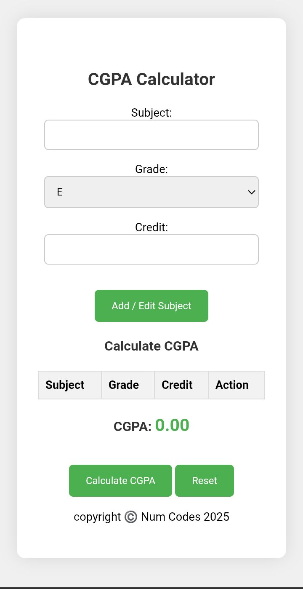

# 🎓 CGPA Calculator

A responsive web-based CGPA (Cumulative Grade Point Average) Calculator that allows students to add, edit, and delete subjects with corresponding grades and credit values, and instantly calculate their CGPA based on a defined grading system.



## 🚀 Features

- 📌 Add, edit, or delete subjects with ease.
- 🧮 Instant CGPA calculation based on grades and credit hours.
- 🛡️ Input validation for accurate results.
- 🎨 Clean and responsive UI for both desktop and mobile.
- 💾 All logic handled on the client side (pure HTML/CSS/JS).

---

## 📷 Demo

> **Live Site:** [Coming Soon]

---

## 🛠️ Tech Stack

- **HTML5** – Markup structure
- **CSS3** – Responsive styling
- **JavaScript (Vanilla)** – Functional logic and DOM manipulation

---

## 📚 Grading Scale

The grade points used are:

| Grade | Point |
|-------|-------|
| S     | 10.0  |
| A     | 9.0   |
| B     | 8.0   |
| C     | 7.0   |
| D     | 6.0   |
| F     | 0.0   |

---

## 🖥️ Usage

1. **Clone this repository**

```bash
git clone https://github.com/NumCodes/CGPA.git
cd cgpa
````

2. **Open `index.html` in your browser**

No additional installation or build steps needed. It’s 100% client-side.

---

## 🧪 How It Works

* User enters the subject name, selects grade, and adds the credit.
* Grade is mapped to its corresponding grade point.
* CGPA is calculated as:

  $$
  \text{CGPA} = \frac{\sum (\text{Grade Point} \times \text{Credit})}{\sum \text{Credits}}
  $$

---

## 📁 File Structure

```
├── index.html       # Main HTML structure
├── style.css        # All styling and layout
└── script.js        # JavaScript logic and functionality
```

---

## 🙌 Credits

Built by [Num Codes](https://github.com/NumCodes) © 2025

---

## 📃 License

This project is licensed under the [MIT License](LICENSE).
